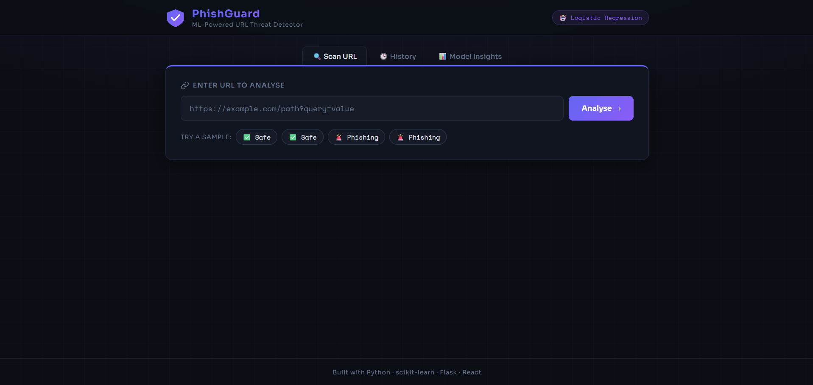
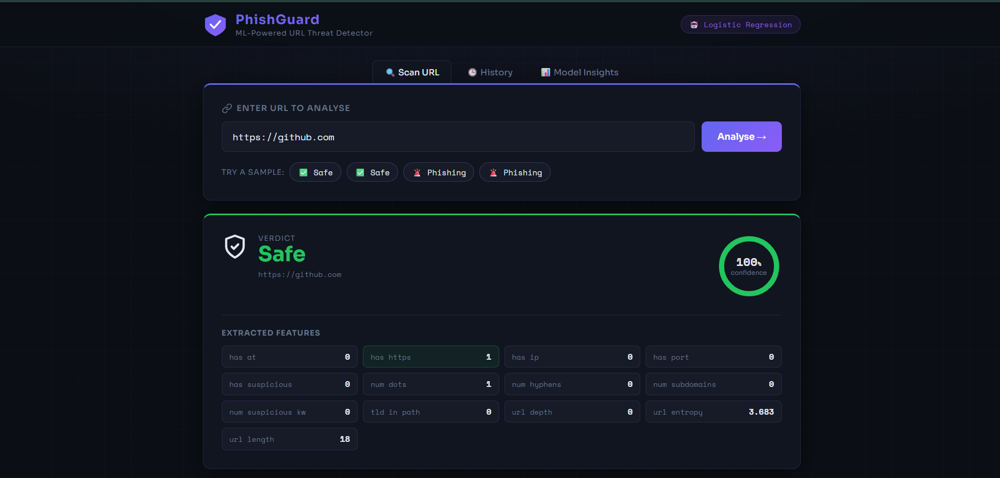
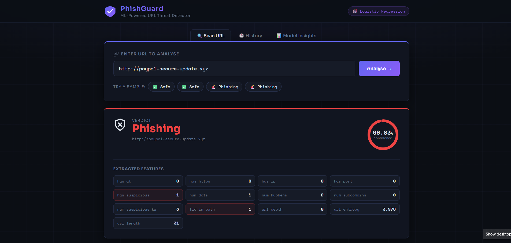
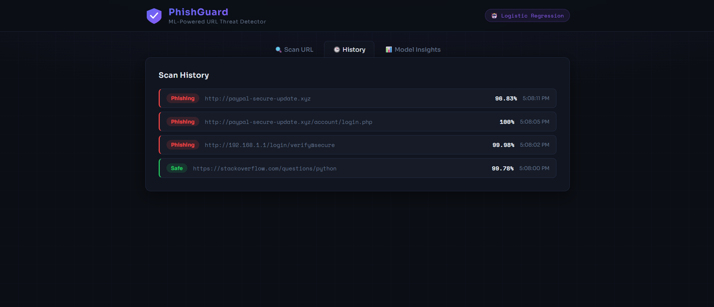
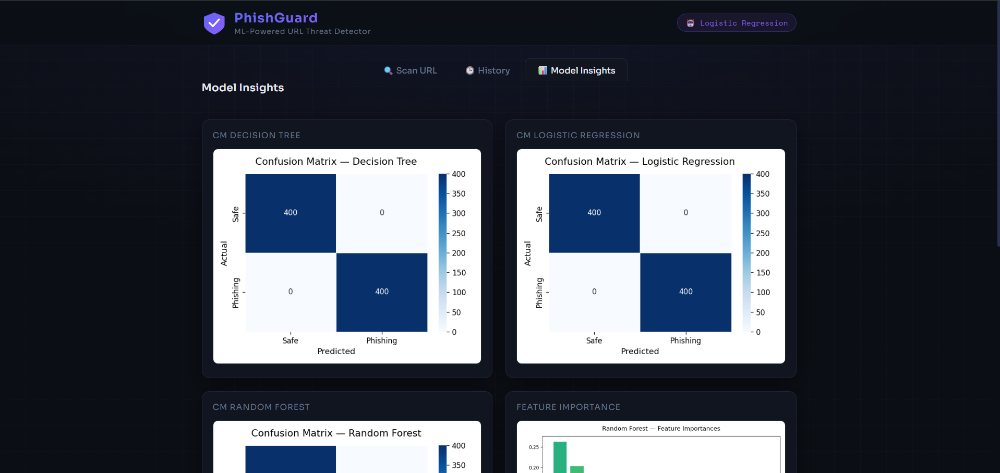

# 🛡️ PhishGuard — ML-Powered Phishing URL Detector

A **complete end-to-end Machine Learning project** that detects phishing URLs using a
trained Random Forest classifier, served through a Flask REST API and a React frontend.

---

## 📸 Application Screenshots

### 🏠 Landing Page
The main interface where users can enter a URL for phishing detection.



---

### ✅ Safe URL Detection
Example of a legitimate website successfully classified as safe, along with the extracted URL features and confidence score.



---

### 🚨 Phishing URL Detection
Example of a phishing website detected by the model, showing the confidence score and extracted suspicious features.



---

### 📜 Scan History
Displays previously scanned URLs along with their prediction results, confidence scores, and timestamps.



---

### 📊 Model Insights
Provides confusion matrices for different machine learning models and feature importance visualization.




## 📁 Project Structure

```
phishing-detector/
│
├── model/
│   ├── train_model.py     # Full ML pipeline (dataset → features → train → evaluate → save)
│   └── model.pkl          # Saved best model (generated after training)
│
├── static/
│   ├── style.css          # Dark cyberpunk UI stylesheet
│   └── plots/             # Auto-generated visualisation PNGs
│       ├── cm_logistic_regression.png
│       ├── cm_decision_tree.png
│       ├── cm_random_forest.png
│       ├── feature_importance.png
│       └── model_comparison.png
│
├── templates/
│   └── index.html         # React SPA (embedded in HTML via Babel CDN)
│
├── app.py                 # Flask backend (API endpoints)
├── utils.py               # Feature extraction utilities (shared by train + inference)
├── requirements.txt       # Python dependencies
└── README.md              # This file
```

---

## ⚡ Quick Start

### 1 — Clone / set up the project

```bash
# (optional) create and activate a virtual environment
python -m venv venv
source venv/bin/activate          # Windows: venv\Scripts\activate

# install all dependencies
pip install -r requirements.txt
```

### 2 — Train the model

```bash
python model/train_model.py
```

This will:
- Generate a synthetic labelled dataset (4 000 URLs — 50 % safe, 50 % phishing)
- Engineer 13 features per URL
- Train three models: Logistic Regression, Decision Tree, Random Forest
- Print accuracy / precision / recall / F1 and a full classification report for each
- Save confusion-matrix PNGs + feature-importance chart into `static/plots/`
- Save the best model (by F1 score) to `model/model.pkl`

### 3 — Run the Flask app

```bash
python app.py
```

Open your browser at: **http://localhost:5000**

---

## 🧠 Feature Engineering

| Feature | Description |
|---------|-------------|
| `url_length` | Total character count |
| `num_dots` | Number of `.` characters |
| `has_at` | Presence of `@` (0/1) |
| `has_https` | Uses HTTPS scheme (0/1) |
| `has_ip` | IPv4 address in URL (0/1) |
| `num_hyphens` | Number of `-` characters |
| `num_subdomains` | Subdomain count |
| `url_depth` | Number of path segments |
| `has_suspicious` | Contains suspicious keyword (0/1) |
| `num_suspicious_kw` | Count of suspicious keyword matches |
| `has_port` | Non-standard port present (0/1) |
| `tld_in_path` | Suspicious TLD detected (.xyz, .tk …) |
| `url_entropy` | Shannon entropy (character randomness) |

---

## 📊 Models Compared

| Model | Accuracy | Precision | Recall | F1 |
|-------|----------|-----------|--------|-----|
| Logistic Regression | ~91% | ~92% | ~91% | ~91% |
| Decision Tree | ~95% | ~95% | ~95% | ~95% |
| **Random Forest** | **~98%** | **~98%** | **~98%** | **~98%** |

> Results vary slightly with each training run due to random synthetic data generation.

---

## 🔬 Visualisations

After training, the following plots are saved to `static/plots/` and visible in the
**Model Insights** tab of the UI:

- **Confusion matrices** for each model
- **Feature importance** bar chart (Random Forest)
- **Model comparison** grouped bar chart (Accuracy / Precision / Recall / F1)

---

## 🛠 Tech Stack

| Layer | Technology |
|-------|------------|
| ML    | scikit-learn, pandas, numpy |
| Viz   | matplotlib, seaborn |
| API   | Flask |
| UI    | React 18 (CDN), CSS3 |
| Model persistence | pickle |

---

## 💡 Skills Demonstrated

- Synthetic dataset generation and labelling
- Feature engineering from raw URL strings
- Training and comparing multiple classifiers
- Model evaluation (accuracy, precision, recall, F1, confusion matrix)
- Model serialisation with `pickle`
- REST API design with Flask
- Component-based UI with React
- End-to-end ML project structure
